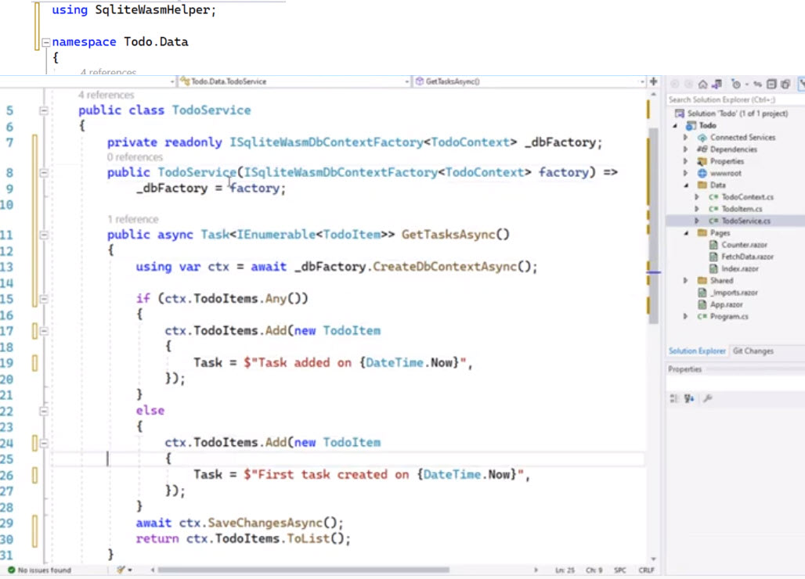
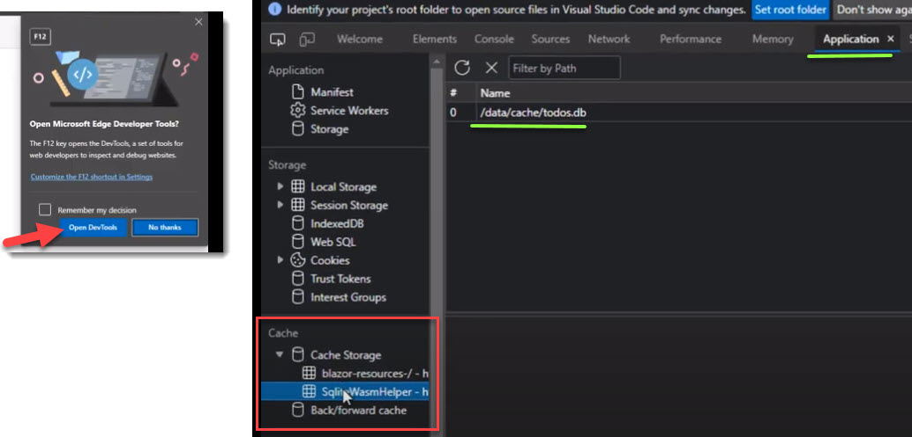
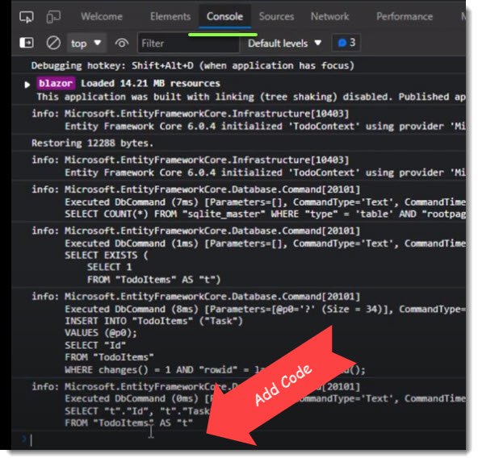
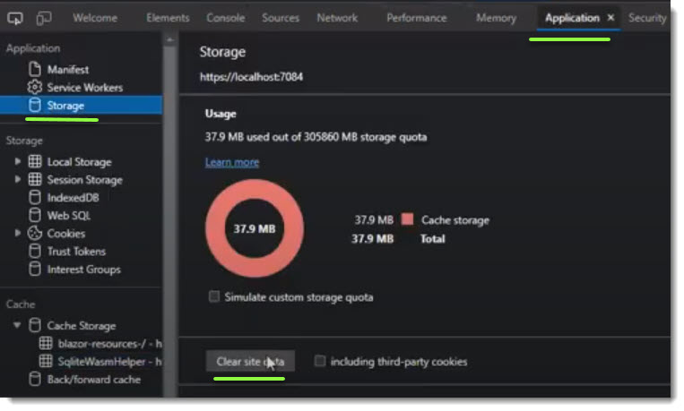
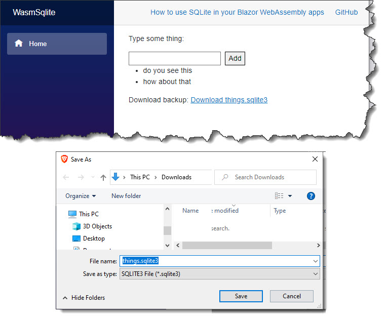
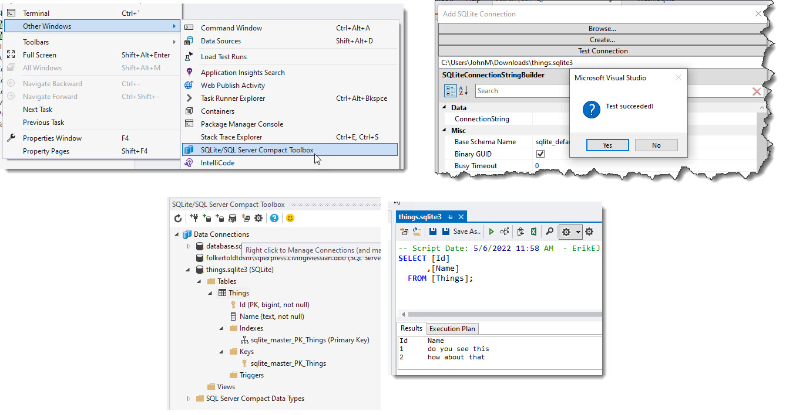

### [Embed SQLite in the WASM App; <sup>1:48</sup>](https://www.youtube.com/watch?v=ZeJISZgy-FM?t=1m48s)
> We need this version of SQLite to be built and embedded in the Blazor App

**WasmSqlite.proj**
```
<WasmBuildNative>true</WasmBuildNative>
```


### [Create a data context; <sup>1:59</sup>](https://www.youtube.com/watch?v=ZeJISZgy-FM?t=1m59s)
> Add EFCore data context

**\Data\ThingContext.cs**
- Note, Initialize `DbSet` with null **bang**
```csharp
using Microsoft.EntityFrameworkCore;
namespace WasmSqlite.Data;

public class ThingContext : DbContext
{
	public ThingContext(DbContextOptions<ThingContext> opts) : base(opts)
	{

	}
	public DbSet<Thing> Things { get; set; } = null!; // Initialize with null bang
}
```


### [Register and configure EF Core; <sup>2:55</sup> ](https://www.youtube.com/watch?v=ZeJISZgy-FM?t=2m55s)
> To enable DI, you need to register SqliteWasmHelper

> It's similar to AddDbContext or DB Context factory

> <sup>3:28</sup> WASM has a virtual file system so it's a mini application that looks like it's on a regular file system even though it's in memory.
> So for SQLite, we give it a data source...`"Data Source=things.sqlite3"` by giving it a file name even though it's really a virtual file name.


**Program.cs**
> using the `AddSqliteWasmDbContextFactory`
```csharp
using WasmSqlite.Data;
using Microsoft.EntityFrameworkCore;
using SqliteWasmHelper;

//...

builder.Services.AddSqliteWasmDbContextFactory<ThingContext>(
    opts => opts.UseSqlite("Data Source=things.sqlite3"));
```


### [Make changes to `Data\ToDoService.cs` <sup>3:50</sup>](https://www.youtube.com/watch?v=ZeJISZgy-FM?t=3m50s)
> **Note** this file wasn't in the GitHub download
> Inject the factory into the service and used the service instead of the in memory list, i.e. this can be removed
> - `private readonly List<ToDoItem> _todoItems = new();`



### [Open the Edge Developer Tools <i>F12</i> <sup>6:00</sup>](https://www.youtube.com/watch?v=ZeJISZgy-FM?t=6m00s)
> 




```csharp
const cache = await caches.open("SQLiteWasmHelper");			// ==> undefined
const resp = await cache.match("/data/cache/todos.db");  // ==> undefined
const blob = await resp.blob();															// ==> undefined
URL.createObjectURL(blob) // ==> 'blob:https://localhost:7084/--guid-thingy--'
```




### [Download and inspect the blob <sup>6:65</sup>](https://www.youtube.com/watch?v=ZeJISZgy-FM?t=6m55s)
> The database itself is stored in a blob

> To download and inspect the database/blob, use `CreateObjectURL()`, which gives you a link that if you click on will give you a download which is the SQLite db.


#### Clear the cache


### Screen Shot


### SQLite Explorer
- [SQLite and SQL Server Compact Toolbox](https://marketplace.visualstudio.com/items?itemName=ErikEJ.SQLServerCompactSQLiteToolbox) Market Place

 

#### Markdown Editor Notes
- [GitHub ](https://github.com/madskristensen/MarkdownEditor)


<!---
How to add emojis :octocat:
-->